# NoblePay Component Architecture

## Frontend Component Hierarchy

```mermaid
graph TD
    App[App.tsx - Root Component]
    
    App --> Router[Router Component]
    
    Router --> Index[Index.tsx - Main Page]
    Router --> Auth[Authentication Pages]
    Router --> Dashboard[User Dashboard]
    Router --> Admin[Admin Panel]
    
    Index --> Header[Header.tsx]
    Index --> Hero[Hero.tsx]
    Index --> RemittanceSection[RemittanceSection.tsx]
    Index --> MobileMoneySection[MobileMoneySection.tsx]
    Index --> BillsSection[BillsSection.tsx]
    Index --> PaymentsSection[PaymentsSection.tsx]
    Index --> MarketplaceSection[MarketplaceSection.tsx]
    Index --> Footer[Footer.tsx]
    
    Header --> Navigation[Navigation Component]
    Header --> UserMenu[User Menu Component]
    
    Hero --> StatsCard[Statistics Card]
    Hero --> CTAButtons[Call-to-Action Buttons]
    
    RemittanceSection --> Calculator[Remittance Calculator]
    RemittanceSection --> CountrySelector[Country Selector]
    RemittanceSection --> ExchangeRateDisplay[Exchange Rate Display]
    
    MobileMoneySection --> ProviderList[Provider List]
    MobileMoneySection --> TopUpForm[Top-up Form]
    MobileMoneySection --> FeatureCards[Feature Cards]
    
    BillsSection --> BillCategories[Bill Categories]
    BillsSection --> PaymentForm[Payment Form]
    BillsSection --> RecentBills[Recent Bills]
    
    PaymentsSection --> QRGenerator[QR Code Generator]
    PaymentsSection --> QRScanner[QR Code Scanner]
    PaymentsSection --> P2PForm[P2P Transfer Form]
    PaymentsSection --> MerchantDirectory[Merchant Directory]
    
    MarketplaceSection --> ProductGrid[Product Grid]
    MarketplaceSection --> ShoppingCart[Shopping Cart]
    MarketplaceSection --> CategoryFilter[Category Filter]
    MarketplaceSection --> ProductCard[Product Card]
    
    Footer --> QuickLinks[Quick Links]
    Footer --> SocialLinks[Social Media Links]
    Footer --> CountryList[Supported Countries]
```



## Component Specifications

### Core Layout Components

#### App.tsx
```typescript
interface AppProps {}
interface AppState {
  user: User | null;
  theme: 'light' | 'dark';
  language: string;
}

// Providers: AuthContext, ThemeContext, LanguageContext
```

#### Header.tsx
```typescript
interface HeaderProps {
  user?: User;
  onMenuToggle: () => void;
}

// Features: Navigation, User authentication status, Mobile menu
```

#### Footer.tsx
```typescript
interface FooterProps {
  countries: Country[];
  services: Service[];
}

// Features: Newsletter signup, Country list, Service links, Social media
```

### Feature Components

#### RemittanceSection.tsx
```typescript
interface RemittanceSectionProps {
  countries: Country[];
  exchangeRates: ExchangeRate[];
}

interface RemittanceState {
  sendAmount: string;
  selectedCountry: string;
  recipientAmount: string;
  fees: number;
}

// Key Functions:
// - calculateRecipientAmount()
// - validateTransferLimits()
// - getExchangeRate()
```

#### MobileMoneySection.tsx
```typescript
interface MobileMoneyProvider {
  id: string;
  name: string;
  logo: string;
  countries: string[];
  users: string;
  color: string;
}

interface TopUpFormState {
  phoneNumber: string;
  amount: number;
  provider: string;
  country: string;
}

// Key Functions:
// - detectProvider()
// - validatePhoneNumber()
// - processTopUp()
```

#### BillsSection.tsx
```typescript
interface BillProvider {
  id: string;
  name: string;
  category: BillCategory;
  countries: string[];
  icon: string;
}

enum BillCategory {
  ELECTRICITY = 'electricity',
  WATER = 'water',
  INTERNET = 'internet',
  TV = 'tv'
}

// Key Functions:
// - getBillsByCountry()
// - validateBillNumber()
// - processBillPayment()
```

#### PaymentsSection.tsx
```typescript
interface QRPaymentData {
  merchantId: string;
  amount?: number;
  currency: string;
  description?: string;
}

interface P2PTransfer {
  recipientId: string;
  amount: number;
  currency: string;
  note?: string;
}

// Key Functions:
// - generateQRCode()
// - scanQRCode()
// - processP2PTransfer()
```

#### MarketplaceSection.tsx
```typescript
interface Product {
  id: string;
  name: string;
  price: string;
  image: string;
  rating: number;
  seller: string;
  category: ProductCategory;
}

interface CartItem {
  product: Product;
  quantity: number;
}

// Key Functions:
// - addToCart()
// - removeFromCart()
// - calculateTotal()
// - processCheckout()
```

## Shared UI Components

### Shadcn-ui Components Used
- **Card**: Product cards, feature cards, form containers
- **Button**: CTAs, form submissions, navigation
- **Input**: Form fields, search boxes
- **Select**: Country selectors, dropdowns
- **Badge**: Status indicators, category tags
- **Dialog**: Modals, confirmations
- **Tabs**: Navigation within sections
- **Progress**: Loading states, form progress

### Custom Components
```typescript
// Currency Display Component
interface CurrencyDisplayProps {
  amount: number;
  currency: string;
  locale?: string;
}

// Country Flag Component
interface CountryFlagProps {
  countryCode: string;
  size?: 'sm' | 'md' | 'lg';
}

// Loading Spinner Component
interface LoadingSpinnerProps {
  size?: 'sm' | 'md' | 'lg';
  text?: string;
}

// Error Boundary Component
interface ErrorBoundaryProps {
  fallback: React.ComponentType;
  children: React.ReactNode;
}
```

## State Management Architecture

### Context Providers
```typescript
// Auth Context
interface AuthContextType {
  user: User | null;
  login: (credentials: LoginCredentials) => Promise<void>;
  logout: () => void;
  register: (userData: RegisterData) => Promise<void>;
  isLoading: boolean;
}

// Cart Context
interface CartContextType {
  items: CartItem[];
  addItem: (product: Product) => void;
  removeItem: (productId: string) => void;
  updateQuantity: (productId: string, quantity: number) => void;
  clearCart: () => void;
  total: number;
}

// Settings Context
interface SettingsContextType {
  theme: Theme;
  language: Language;
  currency: string;
  country: string;
  updateTheme: (theme: Theme) => void;
  updateLanguage: (language: Language) => void;
}
```

## Component Communication Patterns

### Data Flow
1. **Top-Down**: Props passed from parent to child components
2. **Bottom-Up**: Event callbacks and state lifting
3. **Context**: Shared state across component tree
4. **Custom Hooks**: Reusable stateful logic

### Event Handling
```typescript
// Example: Remittance calculation flow
User Input → RemittanceSection → Calculator Component → 
API Call → State Update → UI Re-render
```

### Error Handling
```typescript
// Component-level error boundaries
// Service-level error handling
// User-friendly error messages
// Retry mechanisms for failed requests
```

## Performance Optimizations

### React Optimizations
- **React.memo**: Prevent unnecessary re-renders
- **useMemo**: Expensive calculations caching
- **useCallback**: Function reference stability
- **lazy loading**: Code splitting for route components

### Bundle Optimization
- **Tree shaking**: Remove unused code
- **Code splitting**: Route-based splitting
- **Asset optimization**: Image compression and lazy loading
- **Service worker**: Caching strategies

## Testing Strategy

### Component Testing
```typescript
// Unit tests for individual components
// Integration tests for component interactions
// Accessibility testing
// Visual regression testing
```

### Test Structure
```
src/
├── components/
│   ├── __tests__/
│   │   ├── Header.test.tsx
│   │   ├── RemittanceSection.test.tsx
│   │   └── MarketplaceSection.test.tsx
│   └── ...
├── hooks/
│   ├── __tests__/
│   └── ...
└── utils/
    ├── __tests__/
    └── ...
```

---
*Document Version: 1.0*  
*Last Updated: August 19, 2025*  
*Author: Bob (System Architect)*