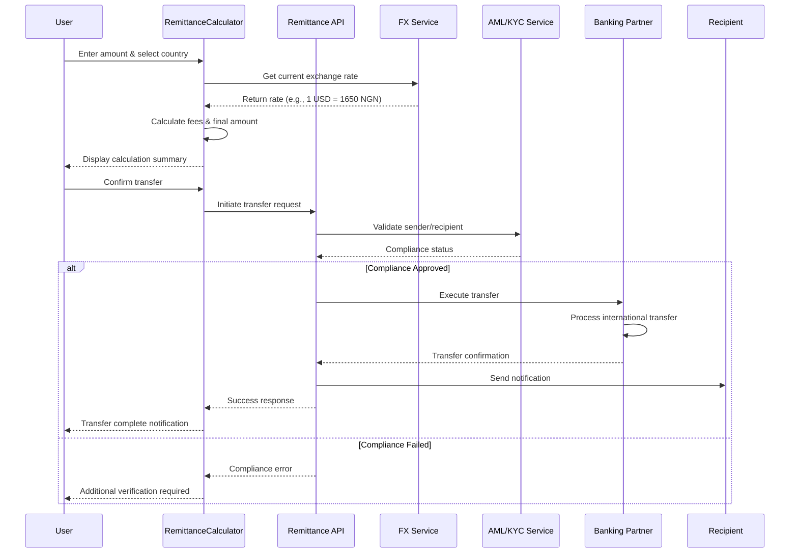
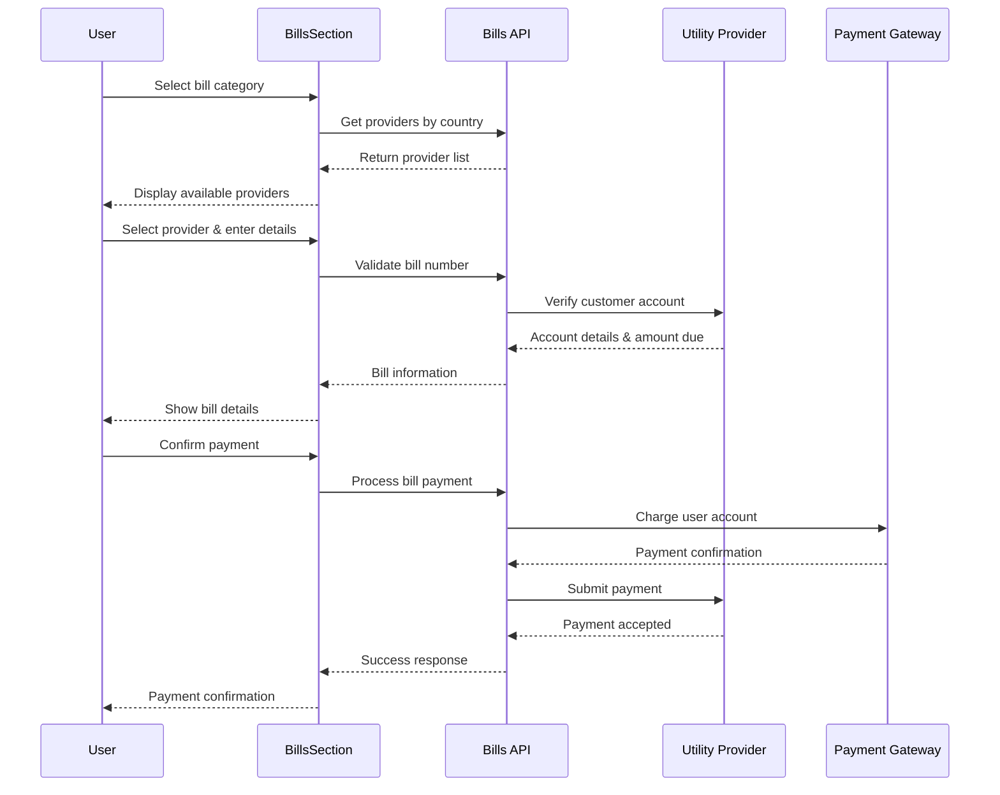
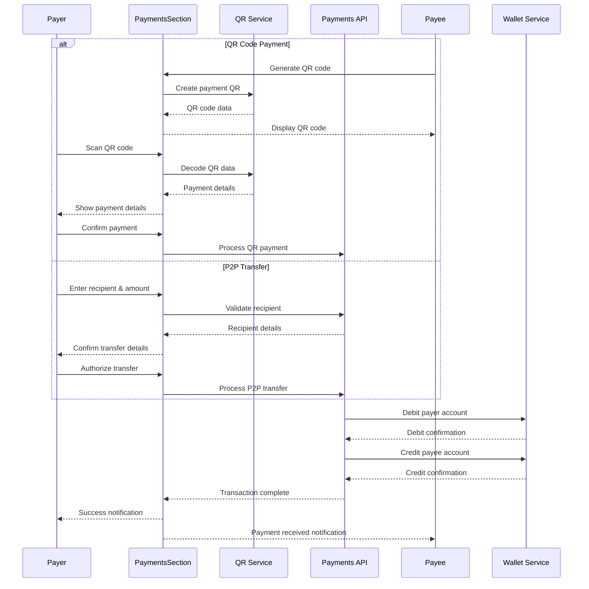
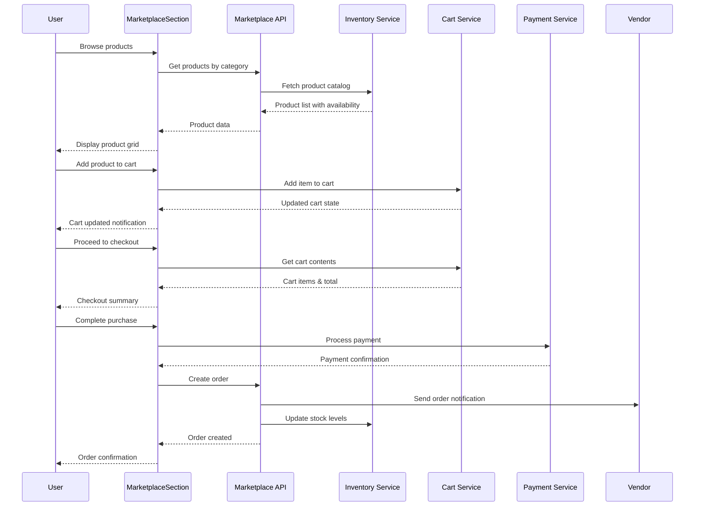
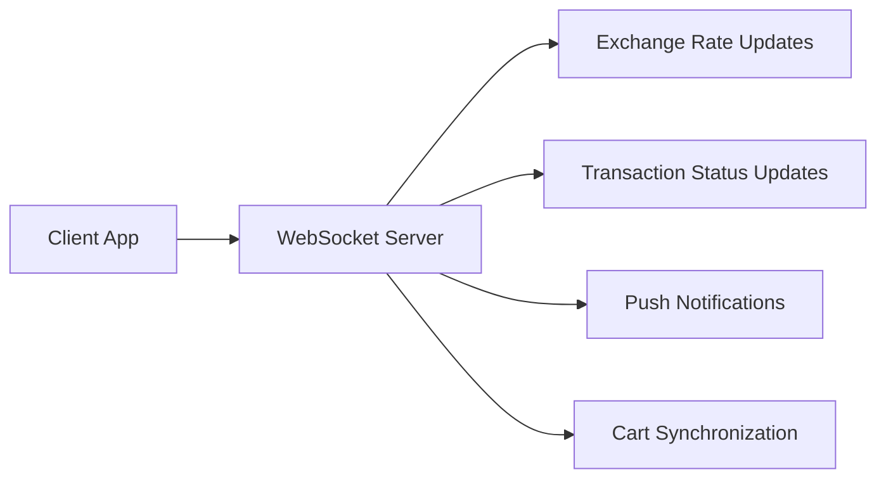
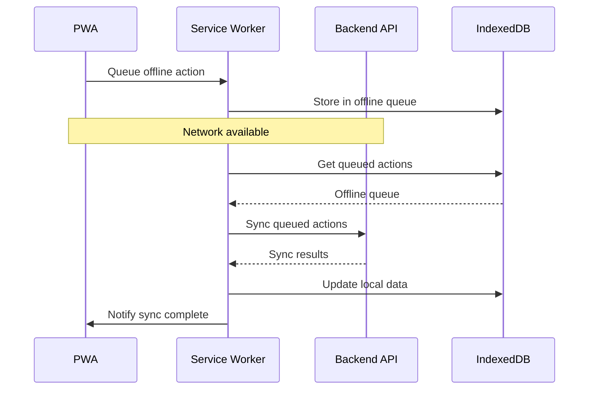
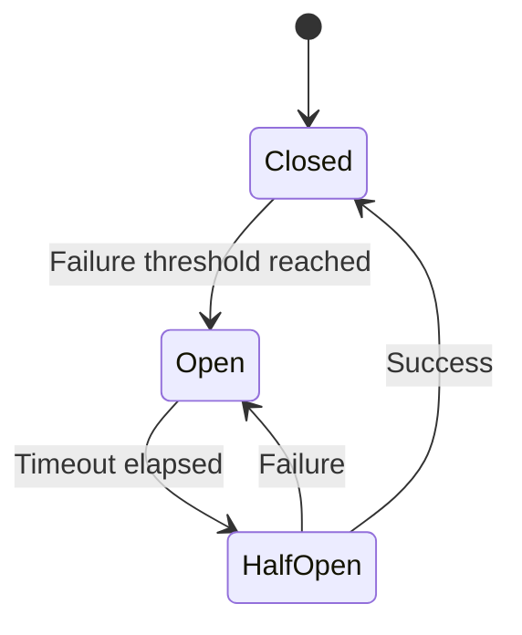

# NoblePay Data Flow Architecture

## Overview
This document details the data flow patterns for NoblePay's core features, showing how information moves through the system from user interaction to backend services and external integrations.

## 1. Cross-Border Remittance Data Flow



### Data Models
```typescript
interface RemittanceTransaction {
  id: string;
  senderId: string;
  recipientId: string;
  sendAmount: number;
  sendCurrency: string;
  receiveAmount: number;
  receiveCurrency: string;
  exchangeRate: number;
  fees: number;
  status: TransactionStatus;
  createdAt: Date;
  completedAt?: Date;
  reference: string;
}

interface ExchangeRate {
  from: string;
  to: string;
  rate: number;
  timestamp: Date;
  source: string;
}

enum TransactionStatus {
  PENDING = 'pending',
  PROCESSING = 'processing',
  COMPLETED = 'completed',
  FAILED = 'failed',
  CANCELLED = 'cancelled'
}
```

## 2. Mobile Money Integration Data Flow

```mermaid
sequenceDiagram
    participant U as User
    participant MM as MobileMoneySection
    participant API as Mobile Money API
    parameter Det as Provider Detection
    participant MTN as MTN API
    participant Airtel as Airtel API
    participant Orange as Orange API
    
    U->>MM: Enter phone number
    MM->>Det: Detect provider from number
    Det-->>MM: Provider identified (e.g., MTN)
    MM-->>U: Show provider & rates
    
    U->>MM: Enter top-up amount
    MM->>MM: Calculate fees & total
    MM-->>U: Display cost breakdown
    
    U->>MM: Confirm top-up
    MM->>API: Create top-up request
    
    alt MTN Provider
        API->>MTN: Initiate top-up
        MTN->>MTN: Process transaction
        MTN-->>API: Transaction result
    else Airtel Provider
        API->>Airtel: Initiate top-up
        Airtel-->>API: Transaction result
    else Orange Provider
        API->>Orange: Initiate top-up
        Orange-->>API: Transaction result
    end
    
    API-->>MM: Final status
    MM-->>U: Success/failure notification
```

### Data Models
```typescript
interface MobileMoneyProvider {
  id: string;
  name: string;
  code: string;
  countries: string[];
  apiEndpoint: string;
  supportedOperations: Operation[];
  fees: FeeStructure;
}

interface TopUpTransaction {
  id: string;
  userId: string;
  phoneNumber: string;
  provider: string;
  amount: number;
  fees: number;
  total: number;
  status: TransactionStatus;
  externalReference?: string;
  createdAt: Date;
}

interface FeeStructure {
  fixed: number;
  percentage: number;
  minimum: number;
  maximum: number;
}
```

## 3. Bill Payment Data Flow



### Data Models
```typescript
interface BillProvider {
  id: string;
  name: string;
  category: BillCategory;
  country: string;
  apiEndpoint: string;
  validationPattern: string;
  icon: string;
}

interface BillPayment {
  id: string;
  userId: string;
  provider: string;
  accountNumber: string;
  amount: number;
  fees: number;
  customerName?: string;
  dueDate?: Date;
  status: TransactionStatus;
  receiptNumber?: string;
  createdAt: Date;
}

enum BillCategory {
  ELECTRICITY = 'electricity',
  WATER = 'water',
  INTERNET = 'internet',
  TV = 'tv',
  EDUCATION = 'education'
}
```

## 4. QR/P2P Payment Data Flow



### Data Models
```typescript
interface QRPaymentData {
  merchantId: string;
  merchantName: string;
  amount?: number;
  currency: string;
  description?: string;
  expiresAt?: Date;
}

interface P2PTransfer {
  id: string;
  senderId: string;
  recipientId: string;
  amount: number;
  currency: string;
  fees: number;
  description?: string;
  status: TransactionStatus;
  createdAt: Date;
}

interface WalletTransaction {
  id: string;
  walletId: string;
  type: 'debit' | 'credit';
  amount: number;
  balance: number;
  reference: string;
  description: string;
  createdAt: Date;
}
```

## 5. Marketplace Data Flow



### Data Models
```typescript
interface Product {
  id: string;
  name: string;
  description: string;
  price: number;
  currency: string;
  category: ProductCategory;
  vendor: string;
  stock: number;
  images: string[];
  rating: number;
  reviews: number;
  countryAvailability: string[];
}

interface CartItem {
  productId: string;
  quantity: number;
  price: number;
  addedAt: Date;
}

interface Order {
  id: string;
  userId: string;
  items: OrderItem[];
  subtotal: number;
  taxes: number;
  shipping: number;
  total: number;
  status: OrderStatus;
  shippingAddress: Address;
  createdAt: Date;
}

enum OrderStatus {
  PENDING = 'pending',
  CONFIRMED = 'confirmed',
  SHIPPED = 'shipped',
  DELIVERED = 'delivered',
  CANCELLED = 'cancelled'
}
```

## 6. Real-time Data Synchronization

### WebSocket Connections


### Event-Driven Updates
```typescript
interface WebSocketEvent {
  type: EventType;
  payload: any;
  timestamp: Date;
  userId?: string;
}

enum EventType {
  EXCHANGE_RATE_UPDATE = 'exchange_rate_update',
  TRANSACTION_STATUS_UPDATE = 'transaction_status_update',
  CART_SYNC = 'cart_sync',
  NOTIFICATION = 'notification',
  SYSTEM_MAINTENANCE = 'system_maintenance'
}
```

## 7. Offline Data Handling

### Local Storage Strategy
```typescript
interface OfflineQueue {
  id: string;
  action: string;
  data: any;
  timestamp: Date;
  retries: number;
}

// IndexedDB for offline data
interface OfflineStore {
  transactions: Transaction[];
  exchangeRates: ExchangeRate[];
  products: Product[];
  userProfile: User;
}
```

### Sync Mechanism


## 8. Error Handling & Recovery

### Error Flow Patterns
```typescript
interface ErrorResponse {
  code: string;
  message: string;
  details?: any;
  timestamp: Date;
  requestId: string;
}

// Retry mechanism for failed requests
interface RetryConfig {
  maxRetries: number;
  backoffMultiplier: number;
  retryableErrors: string[];
}
```

### Circuit Breaker Pattern


---
*Document Version: 1.0*  
*Last Updated: August 19, 2025*  
*Author: Bob (System Architect)*