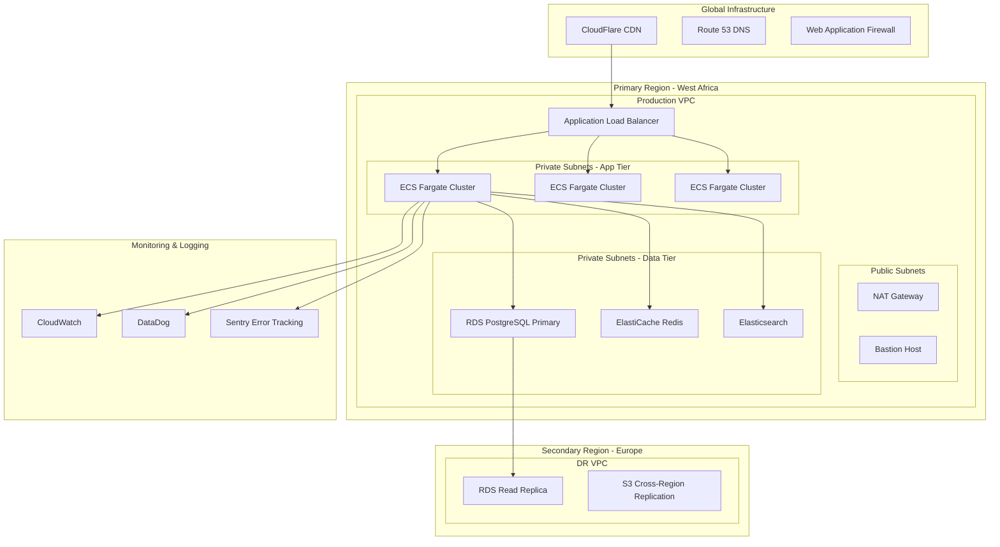

# NoblePay Deployment & Infrastructure Architecture

## Infrastructure Overview
NoblePay employs a cloud-native, microservices architecture designed for high availability, scalability, and regulatory compliance across 9 West African countries.

## Cloud Infrastructure Architecture



## Container Orchestration

### Docker Configuration
```dockerfile
# Multi-stage build for Node.js API
FROM node:18-alpine AS builder

WORKDIR /app
COPY package*.json ./
RUN npm ci --only=production

FROM node:18-alpine AS runtime
RUN addgroup -g 1001 -S nodejs
RUN adduser -S nextjs -u 1001

WORKDIR /app
COPY --from=builder /app/node_modules ./node_modules
COPY . .

USER nextjs
EXPOSE 3000
CMD ["node", "server.js"]
```

### ECS Fargate Service Definition
```yaml
# docker-compose.yml for local development
version: '3.8'

services:
  api:
    build: 
      context: ./api
      dockerfile: Dockerfile
    ports:
      - "3001:3001"
    environment:
      - NODE_ENV=development
      - DATABASE_URL=postgresql://user:password@db:5432/noblepay
      - REDIS_URL=redis://redis:6379
    depends_on:
      - db
      - redis

  web:
    build:
      context: ./web
      dockerfile: Dockerfile
    ports:
      - "3000:3000"
    environment:
      - NEXT_PUBLIC_API_URL=http://api:3001
    depends_on:
      - api

  db:
    image: postgres:15-alpine
    environment:
      - POSTGRES_DB=noblepay
      - POSTGRES_USER=user
      - POSTGRES_PASSWORD=password
    ports:
      - "5432:5432"
    volumes:
      - postgres_data:/var/lib/postgresql/data

  redis:
    image: redis:7-alpine
    ports:
      - "6379:6379"
    volumes:
      - redis_data:/data

volumes:
  postgres_data:
  redis_data:
```

## Environment Configuration

### Development Environment
```typescript
interface DevEnvironment {
  infrastructure: {
    compute: 'Docker Compose';
    database: 'PostgreSQL (local)';
    cache: 'Redis (local)';
    storage: 'Local filesystem';
  };
  
  features: {
    hotReload: true;
    mockServices: true;
    debugMode: true;
    testData: true;
  };
  
  resources: {
    cpu: '2 cores';
    memory: '4GB RAM';
    storage: '50GB SSD';
  };
}
```

### Production Environment
```typescript
interface ProductionEnvironment {
  infrastructure: {
    compute: 'ECS Fargate (3+ instances)';
    database: 'RDS PostgreSQL (Multi-AZ)';
    cache: 'ElastiCache Redis (Cluster mode)';
    storage: 'S3 Standard-IA with lifecycle';
    cdn: 'CloudFlare';
  };
  
  highAvailability: {
    multiAZ: true;
    crossRegion: true;
    autoScaling: true;
    healthChecks: true;
  };
  
  security: {
    waf: 'AWS WAF';
    ddosProtection: 'CloudFlare';
    vpc: 'Private subnets';
    encryption: 'KMS managed keys';
  };
}
```

## Auto-Scaling Configuration

### Application Auto-Scaling
```typescript
const autoScalingConfig = {
  api: {
    metrics: ['cpu_utilization', 'memory_utilization'],
    targetCpuUtilization: 70,
    targetMemoryUtilization: 80,
    scaleUpCooldown: 300, // 5 minutes
    scaleDownCooldown: 900, // 15 minutes
    minInstances: 3,
    maxInstances: 20
  }
};
```

## CI/CD Pipeline

### GitHub Actions Workflow
```yaml
name: Deploy to Production

on:
  push:
    branches: [main]

jobs:
  test:
    runs-on: ubuntu-latest
    steps:
    - uses: actions/checkout@v3
    - name: Setup Node.js
      uses: actions/setup-node@v3
      with:
        node-version: '18'
    - name: Run tests
      run: npm test

  deploy:
    needs: test
    runs-on: ubuntu-latest
    steps:
    - name: Deploy to ECS
      run: |
        aws ecs update-service \
          --cluster noblepay-production \
          --service noblepay-api \
          --force-new-deployment
```

## Monitoring & Health Checks

### Health Check Implementation
```typescript
interface HealthCheck {
  status: 'healthy' | 'unhealthy' | 'degraded';
  timestamp: Date;
  services: ServiceHealth[];
  uptime: number;
  version: string;
}

app.get('/health', async (req, res) => {
  const healthCheck: HealthCheck = {
    status: 'healthy',
    timestamp: new Date(),
    services: [
      await checkDatabase(),
      await checkRedis(),
      await checkExternalAPIs()
    ],
    uptime: process.uptime(),
    version: process.env.APP_VERSION
  };
  
  res.status(200).json(healthCheck);
});
```

## Disaster Recovery

### Backup Strategy
```typescript
interface BackupStrategy {
  database: {
    frequency: 'daily';
    retention: '30 days';
    type: 'automated_snapshot';
    crossRegion: true;
  };
  
  files: {
    frequency: 'continuous';
    retention: '90 days';
    type: 'cross_region_replication';
  };
}
```

### Recovery Targets
```typescript
interface RecoveryTargets {
  criticalServices: {
    rto: '4 hours'; // Recovery Time Objective
    rpo: '1 hour';  // Recovery Point Objective
  };
  
  standardServices: {
    rto: '24 hours';
    rpo: '4 hours';
  };
}
```

---
*Document Version: 1.0*  
*Last Updated: August 19, 2025*  
*Author: Bob (System Architect)*