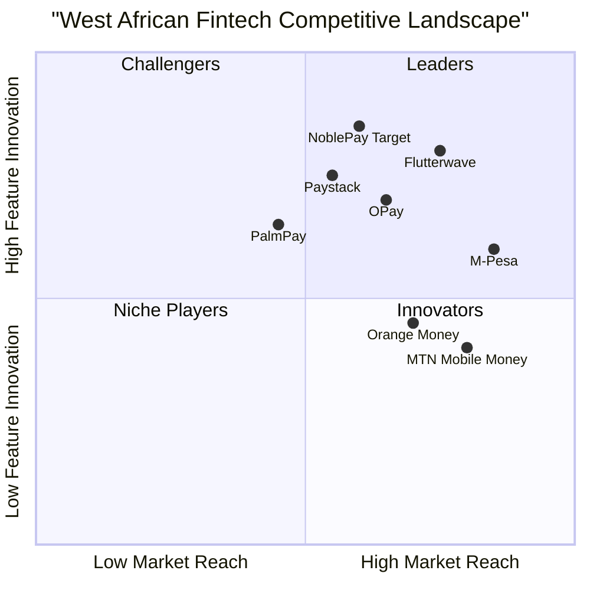

# NoblePay Product Requirements Document (PRD)
**Version:** 1.0  
**Date:** August 2025  
**Author:** Emma Johnson, Product Manager  
**Project:** NoblePay - Digital Financial Ecosystem for West Africa

---

## 1. Executive Summary

### 1.1 Language & Project Information
- **Language:** English
- **Programming Language:** TypeScript, React, Shadcn-UI, Tailwind CSS
- **Project Name:** noblepay_west_africa_fintech
- **Original Requirements:** Create a progressive web application cross-platform (mobile + desktop) digital financial ecosystem designed to empower underserved and underbanked populations in West Africa

### 1.2 Product Definition

#### Product Goals
1. **Financial Inclusion Goal:** Provide accessible digital financial services to underbanked populations across 9 West African countries, targeting 57% unbanked adults in Sub-Saharan Africa
2. **Cross-Border Efficiency Goal:** Streamline remittance processes from USA to West Africa with transparent exchange rates and fees under $3, reducing traditional 7-10% fees to 2-3%
3. **Ecosystem Integration Goal:** Create unified platform connecting mobile money, bill payments, merchant services, and e-commerce to drive daily financial activities

#### User Stories
1. **As an immigrant worker in the USA**, I want to send money to my family in Nigeria with real-time exchange rates and low fees, so that more money reaches my loved ones quickly
2. **As a rural farmer in Guinea**, I want to receive payments from crop buyers through mobile money and pay for seeds/fertilizers digitally, so that I can participate in the digital economy without traveling to banks
3. **As a small business owner in Ghana**, I want to accept QR code payments from customers and manage inventory through integrated marketplace, so that I can modernize my business operations
4. **As a university student in Sierra Leone**, I want to pay utility bills, buy airtime, and shop for essentials through one secure app, so that I can manage all financial needs conveniently
5. **As a diaspora community member**, I want to support local businesses in my home country by shopping on the integrated marketplace, so that I can contribute to local economic development

#### Competitive Analysis

| Company | Strengths | Weaknesses | Market Position |
|---------|-----------|------------|-----------------|
| **M-Pesa (Safaricom)** | Market leader in East Africa, 50M+ users | Limited West Africa presence, single-country focus | Dominant in Kenya/Tanzania |
| **Flutterwave** | Strong payment processing, 200M+ users | Complex integration, enterprise-focused | Payment infrastructure leader |
| **Paystack** | Developer-friendly APIs, Stripe acquisition | Nigeria-focused, limited rural reach | Nigerian payment processing |
| **OPay** | Super-app model, transportation integration | Limited cross-border features | Nigerian digital payments |
| **PalmPay** | AI-driven features, loan products | Regulatory challenges, limited countries | Nigerian mobile money |
| **Orange Money** | Multi-country presence, telecom backing | Fragmented experience across countries | Regional mobile money |
| **MTN Mobile Money** | Large subscriber base, multi-country | Legacy systems, limited innovation | Traditional mobile money |

#### Competitive Quadrant Chart



---

## 2. Market Analysis

### 2.1 Industry Overview
West Africa's fintech market has experienced explosive growth, with the region doubling mobile money accounts over the past decade. Key market characteristics:

- **Market Size:** West Africa accounts for over one-third of global new mobile money accounts in 2024
- **Growth Rate:** Mobile money accounts grew 110M+ between 2018-2022 in WAEMU region
- **Financial Inclusion:** Increased from 56% to 71% in WAEMU countries
- **GDP Impact:** Mobile money contributed 4.1% GDP growth in West Africa by 2022

### 2.2 Target Market Segmentation

#### Primary Markets (9 Countries)
1. **Nigeria** - 220M population, 65% unbanked, $440B GDP
2. **Ghana** - 33M population, 45% unbanked, $77B GDP  
3. **Côte d'Ivoire** - 28M population, 60% unbanked, $70B GDP
4. **Burkina Faso** - 22M population, 75% unbanked, $19B GDP
5. **Benin** - 13M population, 70% unbanked, $17B GDP
6. **Guinea** - 14M population, 80% unbanked, $16B GDP
7. **Sierra Leone** - 8M population, 85% unbanked, $4B GDP
8. **Liberia** - 5M population, 90% unbanked, $4B GDP

### 2.3 User Demographics
- **Age:** 18-45 years (70% of target market)
- **Income:** $1-10 per day (underbanked segment)
- **Device Usage:** 65% smartphone, 35% feature phone with USSD access
- **Internet Access:** 45% regular internet, 80% mobile network coverage
- **Financial Behavior:** 85% cash-based transactions, 25% mobile money users

---

## 3. Technical Specifications

### 3.1 Requirements Analysis
The NoblePay platform must address critical gaps in West African financial services:

**Functional Requirements:**
- Multi-country currency support (USD, NGN, GHS, XOF, LRD, SLL, GNF)
- Real-time exchange rate integration
- Mobile money provider APIs (MTN, Airtel, Orange, Lonestar, Africell)
- Cross-border remittance processing
- Bill payment integration with local utilities
- QR code generation and scanning
- E-commerce marketplace functionality
- Multi-language support (English, French, local languages)

**Non-Functional Requirements:**
- 99.9% uptime SLA
- <2 second transaction processing
- Support for 1M+ concurrent users
- PCI-DSS compliance
- GDPR and local data protection compliance
- Offline functionality via USSD
- Mobile-first responsive design

### 3.2 Requirements Pool

#### P0 Requirements (Must-Have)
1. **Cross-Border Remittance System**
   - USD to local currency conversion
   - Real-time exchange rates
   - Transaction fees under $3
   - Compliance with anti-money laundering (AML) regulations

2. **Mobile Money Integration**
   - Direct API connections with 6 major providers
   - Account balance checking
   - Fund transfers and top-ups
   - Transaction history synchronization

3. **Security & Compliance**
   - End-to-end encryption for all transactions
   - Two-factor authentication
   - Biometric authentication support
   - Regulatory compliance across 9 countries

#### P1 Requirements (Should-Have)
1. **Bill Payment System**
   - Integration with electricity providers (NEPA, ECG, CIE, SONABEL)
   - Water utility payments
   - Internet/TV service payments
   - Mobile airtime purchases

2. **Merchant Payment Solutions**
   - QR code payment processing
   - P2P transfer functionality
   - Merchant dashboard and analytics
   - Payment request generation

#### P2 Requirements (Nice-to-Have)
1. **E-commerce Marketplace**
   - Product catalog management
   - Shopping cart functionality
   - Order tracking and fulfillment
   - Seller onboarding and management

2. **Advanced Features**
   - AI-powered spending insights
   - Savings goal tracking
   - Micro-lending integration
   - Investment products

### 3.3 UI Design Draft

#### Main Navigation Structure
```
Header: Logo | Navigation Menu | User Account | Language Selector
├── Home/Dashboard
├── Send Money (Remittance)
├── Mobile Money
├── Pay Bills
├── Merchant Pay
├── Marketplace
└── Profile/Settings
```

#### Key Interface Elements
- **Calculator Interface:** Real-time conversion display with fee transparency
- **Country Selector:** Flag-based dropdown with search functionality
- **Provider Selection:** Logo-based grid for mobile money providers
- **Transaction Status:** Real-time progress indicators with SMS/push notifications
- **Responsive Design:** Mobile-first with desktop optimization

### 3.4 Open Questions
1. **Regulatory Compliance:** What are the specific licensing requirements for each country?
2. **Banking Partnerships:** Which local banks should we partner with for cash-out services?
3. **KYC Requirements:** How do KYC requirements vary across the 9 target countries?
4. **Currency Hedging:** What strategy should we use to manage foreign exchange risk?
5. **Offline Functionality:** How extensive should USSD integration be for feature phone users?

---

## 4. Business Requirements

### 4.1 Success Metrics

#### Primary KPIs
- **User Acquisition:** 100K users in Year 1, 1M users by Year 3
- **Transaction Volume:** $10M monthly by Year 2, $100M monthly by Year 4  
- **Geographic Coverage:** 50% of target regions within 18 months
- **Financial Inclusion Impact:** 25% of users previously unbanked

#### Secondary KPIs
- **Customer Acquisition Cost (CAC):** Under $15 per user
- **Lifetime Value (LTV):** $200+ per user over 3 years
- **Monthly Active Users:** 70%+ engagement rate
- **Net Promoter Score (NPS):** 50+ customer satisfaction

### 4.2 Revenue Model
1. **Transaction Fees:** 1-3% on remittances, 0.5-1% on local transfers
2. **Currency Exchange:** 1-2% margin on exchange rates
3. **Bill Payment Commission:** 1-2% from utility providers
4. **Marketplace Commission:** 3-5% on merchant transactions
5. **Premium Services:** $2-5/month for advanced features

### 4.3 Go-to-Market Strategy

#### Phase 1: Foundation (Months 1-6)
- Launch in Nigeria and Ghana (largest markets)
- Partner with 2-3 major mobile money providers
- Focus on diaspora remittance use case

#### Phase 2: Expansion (Months 7-18)
- Add Côte d'Ivoire, Burkina Faso, and Benin
- Launch bill payment and merchant services
- Rural market penetration through agent networks

#### Phase 3: Ecosystem (Months 19-36)
- Complete 9-country coverage
- Launch marketplace and advanced features
- Partnership with banks and microfinance institutions

---

## 5. Risk Assessment

### 5.1 Technical Risks
- **API Integration Complexity:** Multiple mobile money provider APIs with varying standards
- **Scalability Challenges:** Handling peak remittance volumes during holidays
- **Security Vulnerabilities:** Protecting financial data across multiple jurisdictions

### 5.2 Business Risks
- **Regulatory Changes:** Evolving fintech regulations across 9 countries
- **Competition:** Established players with deeper resources
- **Currency Volatility:** Exchange rate fluctuations affecting margins

### 5.3 Mitigation Strategies
- **Regulatory:** Hire local compliance experts in each market
- **Technical:** Implement microservices architecture for scalability
- **Financial:** Establish currency hedging partnerships

---

## 6. Implementation Timeline

### 6.1 Development Phases
- **Q1 2025:** Core platform development and Nigeria/Ghana launch
- **Q2 2025:** Mobile money integration and bill payment services
- **Q3 2025:** Multi-country expansion and merchant services
- **Q4 2025:** Marketplace launch and advanced features

### 6.2 Resource Requirements
- **Development Team:** 12-15 developers (frontend, backend, mobile)
- **Business Team:** 8-10 members (product, marketing, compliance)
- **Regional Teams:** 3-4 country managers for local partnerships

---

## 7. Appendices

### 7.1 Technical Architecture Overview
- **Frontend:** React/TypeScript with Shadcn-UI
- **Backend:** Node.js/Express with PostgreSQL
- **Infrastructure:** AWS/Azure with CDN
- **Security:** OAuth 2.0, JWT tokens, AES-256 encryption

### 7.2 Regulatory Compliance Matrix
- **Nigeria:** CBN payment service provider license
- **Ghana:** Bank of Ghana payment system license  
- **Regional:** ECOWAS payment system integration

### 7.3 Partnership Strategy
- **Mobile Money:** MTN, Airtel, Orange Money direct partnerships
- **Banking:** Local bank partnerships for cash-out services
- **Technology:** Payment processing and security service providers

---

**Document Status:** Draft v1.0  
**Next Review:** September 2025  
**Stakeholder Approval:** Pending CEO, CTO, Head of Business Development