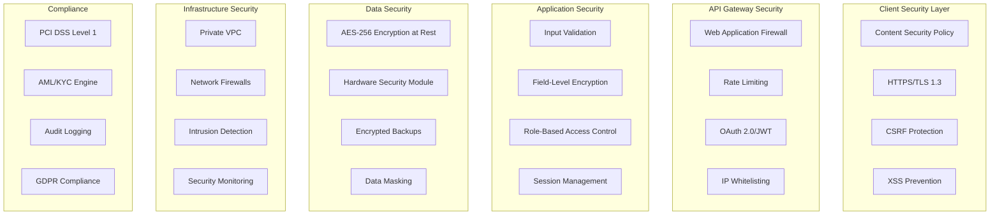
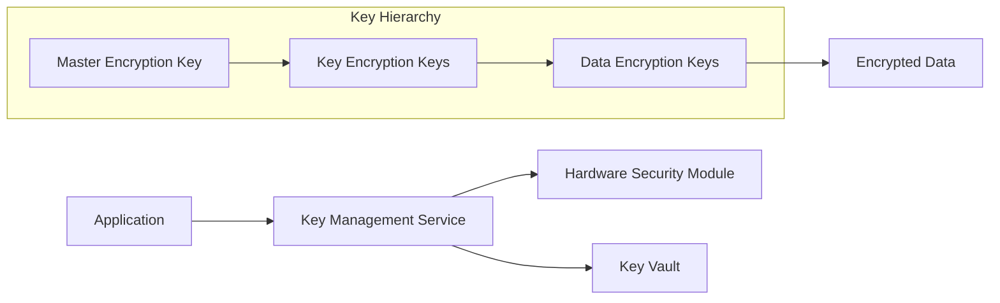
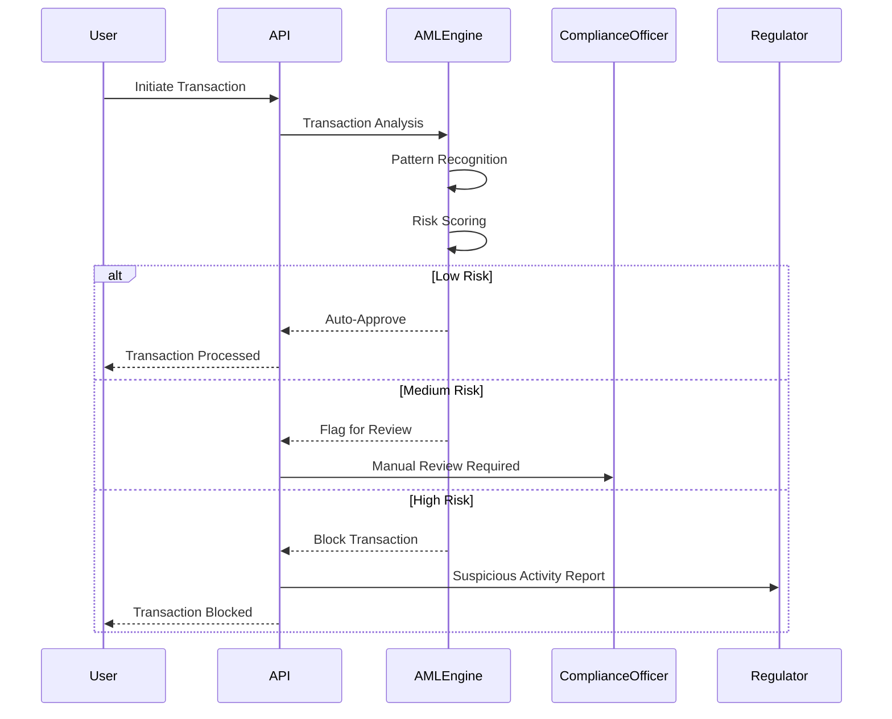
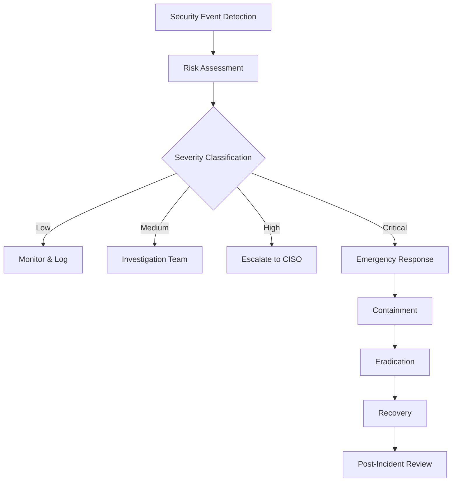

# NoblePay Security & Compliance Architecture

## Security Overview
NoblePay implements a comprehensive security framework designed to protect user data, financial transactions, and comply with international financial regulations across 9 West African countries.

## Security Architecture Layers



## Authentication & Authorization

### Multi-Factor Authentication (MFA)
```typescript
interface MFAConfiguration {
  primaryFactor: AuthMethod;
  secondaryFactors: AuthMethod[];
  fallbackMethods: AuthMethod[];
  riskAssessment: RiskLevel;
}

enum AuthMethod {
  PASSWORD = 'password',
  SMS_OTP = 'sms_otp',
  EMAIL_OTP = 'email_otp',
  BIOMETRIC = 'biometric',
  HARDWARE_TOKEN = 'hardware_token'
}

enum RiskLevel {
  LOW = 'low',
  MEDIUM = 'medium',
  HIGH = 'high'
}

// Risk-based authentication flow
const riskAssessment = {
  deviceTrust: DeviceTrustScore,
  locationRisk: LocationRiskScore,
  behavioralPatterns: BehavioralScore,
  transactionAmount: AmountRiskScore
};
```

### JWT Token Management
```typescript
interface JWTPayload {
  sub: string; // User ID
  iat: number; // Issued at
  exp: number; // Expiration
  aud: string; // Audience
  iss: string; // Issuer
  roles: string[];
  permissions: Permission[];
  sessionId: string;
}

// Token configuration
const tokenConfig = {
  accessToken: {
    expiresIn: '15m',
    algorithm: 'RS256',
    audience: 'noblepay-api'
  },
  refreshToken: {
    expiresIn: '7d',
    rotationEnabled: true,
    reuseDetection: true
  }
};
```

### Role-Based Access Control (RBAC)
```typescript
interface Role {
  id: string;
  name: string;
  permissions: Permission[];
  hierarchy: number;
}

interface Permission {
  resource: string;
  actions: Action[];
  conditions?: Condition[];
}

enum Action {
  CREATE = 'create',
  READ = 'read',
  UPDATE = 'update',
  DELETE = 'delete',
  APPROVE = 'approve'
}

// Predefined roles
const roles = {
  customer: {
    permissions: [
      'transactions:create,read',
      'profile:read,update',
      'wallet:read'
    ]
  },
  merchant: {
    permissions: [
      'products:create,read,update',
      'orders:read',
      'settlements:read'
    ]
  },
  admin: {
    permissions: [
      'users:*',
      'transactions:*',
      'system:*'
    ]
  }
};
```

## Data Protection & Encryption

### Encryption Standards
```typescript
interface EncryptionConfig {
  atRest: {
    algorithm: 'AES-256-GCM';
    keyRotation: '90 days';
    keyManagement: 'AWS KMS' | 'HashiCorp Vault';
  };
  inTransit: {
    protocol: 'TLS 1.3';
    cipherSuites: string[];
    hsts: boolean;
  };
  fieldLevel: {
    piiFields: string[];
    financialFields: string[];
    algorithm: 'AES-256-CBC';
  };
}

// Sensitive data encryption
const encryptedFields = [
  'users.phone_number',
  'users.email',
  'user_profiles.id_document_number',
  'transactions.external_reference',
  'mobile_money_transactions.phone_number'
];
```

### Key Management


## PCI DSS Compliance

### Compliance Requirements
```typescript
interface PCICompliance {
  requirements: {
    buildAndMaintainSecureNetwork: boolean;
    protectCardholderData: boolean;
    maintainVulnerabilityProgram: boolean;
    implementStrongAccessControl: boolean;
    regularlyMonitorNetworks: boolean;
    maintainInfoSecurityPolicy: boolean;
  };
  
  // PCI DSS Level 1 requirements
  auditFrequency: 'annual';
  penetrationTesting: 'quarterly';
  vulnerabilityScanning: 'quarterly';
}

// Cardholder data protection
const cardDataProtection = {
  storage: 'prohibited', // No storage of sensitive auth data
  transmission: 'encrypted', // End-to-end encryption
  display: 'masked', // Only show last 4 digits
  access: 'restricted' // Need-to-know basis
};
```

### Secure Coding Standards
```typescript
// Input validation and sanitization
const inputValidation = {
  sqlInjectionPrevention: 'parameterized_queries',
  xssPrevention: 'output_encoding',
  csrfProtection: 'synchronizer_tokens',
  fileUploadSecurity: 'content_type_validation'
};

// Secure API design
const apiSecurity = {
  authentication: 'required_all_endpoints',
  authorization: 'least_privilege',
  rateLimiting: 'per_user_per_endpoint',
  logging: 'all_security_events'
};
```

## Anti-Money Laundering (AML) & Know Your Customer (KYC)

### AML Transaction Monitoring


### KYC Verification Process
```typescript
interface KYCDocument {
  type: DocumentType;
  number: string;
  issuedBy: string;
  expiryDate: Date;
  imageUrl: string;
  verificationStatus: VerificationStatus;
}

enum DocumentType {
  NATIONAL_ID = 'national_id',
  PASSPORT = 'passport',
  DRIVERS_LICENSE = 'drivers_license',
  UTILITY_BILL = 'utility_bill'
}

interface KYCVerification {
  userId: string;
  documents: KYCDocument[];
  biometricData?: BiometricData;
  status: KYCStatus;
  riskLevel: RiskLevel;
  completedAt?: Date;
  expiresAt: Date;
}

// KYC verification rules by country
const kycRequirements = {
  nigeria: {
    requiredDocuments: ['national_id', 'utility_bill'],
    biometric: true,
    minimumAge: 18
  },
  ghana: {
    requiredDocuments: ['ghana_card', 'proof_of_address'],
    biometric: false,
    minimumAge: 18
  }
};
```

## Fraud Detection & Prevention

### Real-time Fraud Scoring
```typescript
interface FraudScoreModel {
  deviceFingerprinting: number;
  behavioralAnalysis: number;
  transactionPattern: number;
  velocityChecks: number;
  geolocationRisk: number;
  overallScore: number;
}

// Fraud detection rules
const fraudRules = [
  {
    name: 'velocity_check',
    condition: 'transactions_per_hour > 10',
    action: 'flag_for_review',
    weight: 0.3
  },
  {
    name: 'unusual_amount',
    condition: 'amount > average_amount * 5',
    action: 'require_additional_auth',
    weight: 0.4
  },
  {
    name: 'new_device',
    condition: 'device_trust_score < 0.5',
    action: 'step_up_authentication',
    weight: 0.2
  }
];
```

### Device Fingerprinting
```typescript
interface DeviceFingerprint {
  userAgent: string;
  screenResolution: string;
  timezone: string;
  language: string;
  plugins: string[];
  canvas: string;
  webgl: string;
  fingerprint: string;
  trustScore: number;
}

// Device tracking for fraud prevention
const deviceTracking = {
  cookieBased: true,
  localStorageFingerprint: true,
  canvasFingerprinting: true,
  audioFingerprinting: false, // Privacy concern
  batteryApi: false // Deprecated
};
```

## Security Monitoring & Incident Response

### Security Information and Event Management (SIEM)
```typescript
interface SecurityEvent {
  id: string;
  timestamp: Date;
  severity: Severity;
  category: EventCategory;
  source: string;
  description: string;
  userId?: string;
  ipAddress: string;
  userAgent?: string;
  metadata: Record<string, any>;
}

enum Severity {
  LOW = 'low',
  MEDIUM = 'medium',
  HIGH = 'high',
  CRITICAL = 'critical'
}

enum EventCategory {
  AUTHENTICATION = 'authentication',
  AUTHORIZATION = 'authorization',
  TRANSACTION = 'transaction',
  DATA_ACCESS = 'data_access',
  SYSTEM = 'system'
}
```

### Incident Response Plan


## Regulatory Compliance by Country

### Nigeria (CBN Requirements)
```typescript
interface NigeriaCompliance {
  licensing: 'CBN Mobile Money License';
  kycRequirements: {
    tier1: { limit: 'NGN 50,000', documents: ['phone_verification'] };
    tier2: { limit: 'NGN 200,000', documents: ['bvn', 'id_card'] };
    tier3: { limit: 'NGN 5,000,000', documents: ['bvn', 'id_card', 'utility_bill'] };
  };
  reportingRequirements: {
    transactionReporting: 'daily',
    suspiciousActivity: 'immediate',
    regulatory: 'monthly'
  };
}
```

### Ghana (Bank of Ghana Requirements)
```typescript
interface GhanaCompliance {
  licensing: 'BoG E-Money License';
  kycRequirements: {
    basic: { limit: 'GHS 2,000', documents: ['ghana_card'] };
    enhanced: { limit: 'GHS 10,000', documents: ['ghana_card', 'proof_address'] };
  };
  dataResidency: 'local_storage_required';
}
```

## Privacy & Data Protection

### GDPR Compliance
```typescript
interface GDPRCompliance {
  lawfulBasis: LawfulBasis[];
  dataMinimization: boolean;
  consentManagement: ConsentFramework;
  rightToErasure: boolean;
  dataPortability: boolean;
  privacyByDesign: boolean;
}

enum LawfulBasis {
  CONSENT = 'consent',
  CONTRACT = 'contract',
  LEGAL_OBLIGATION = 'legal_obligation',
  LEGITIMATE_INTEREST = 'legitimate_interest'
}

// Data retention policies
const dataRetention = {
  transactionData: '7 years', // Financial regulation requirement
  personalData: '5 years after account closure',
  marketingData: '2 years or until consent withdrawn',
  logFiles: '1 year'
};
```

### Data Subject Rights
```typescript
interface DataSubjectRequest {
  type: RequestType;
  userId: string;
  requestDate: Date;
  completionDate?: Date;
  status: RequestStatus;
  documents?: string[];
}

enum RequestType {
  ACCESS = 'access',
  RECTIFICATION = 'rectification',
  ERASURE = 'erasure',
  PORTABILITY = 'portability',
  RESTRICTION = 'restriction'
}
```

## Security Testing & Validation

### Penetration Testing Schedule
```typescript
interface PenetrationTest {
  type: TestType;
  frequency: string;
  scope: string[];
  methodology: string;
  reportingRequirements: string;
}

const penetrationTestSchedule = {
  external: {
    frequency: 'quarterly',
    scope: ['web_application', 'apis', 'infrastructure'],
    methodology: 'OWASP_ASVS'
  },
  internal: {
    frequency: 'annually',
    scope: ['internal_network', 'databases', 'services'],
    methodology: 'NIST_SP_800-115'
  }
};
```

### Vulnerability Management
```typescript
interface VulnerabilityAssessment {
  scanFrequency: 'weekly';
  criticalPatchWindow: '24 hours';
  highPatchWindow: '7 days';
  mediumPatchWindow: '30 days';
  lowPatchWindow: '90 days';
}

// Security metrics and KPIs
const securityMetrics = {
  meanTimeToDetection: 'MTTD < 15 minutes',
  meanTimeToResponse: 'MTTR < 4 hours',
  falsePositiveRate: '< 5%',
  securityAwareness: '> 90% completion rate'
};
```

---
*Document Version: 1.0*  
*Last Updated: August 19, 2025*  
*Author: Bob (System Architect)*