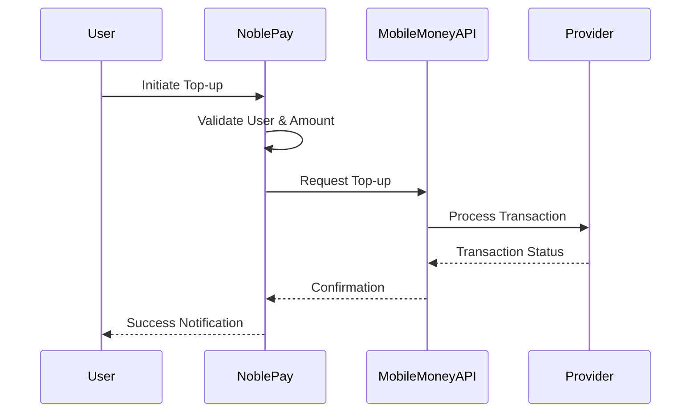
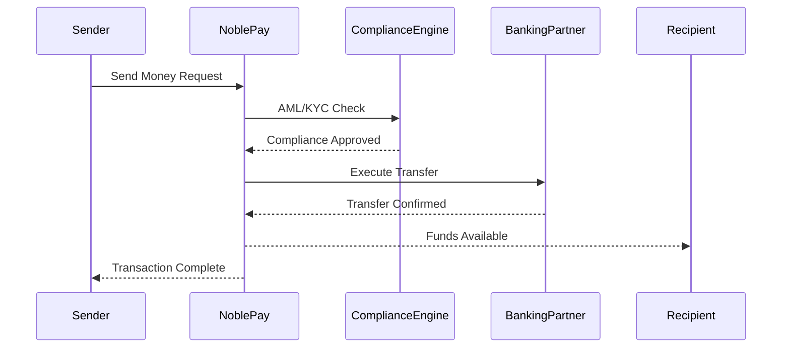

# NoblePay System Architecture Overview

## Executive Summary
This document outlines the comprehensive system architecture for NoblePay, a Progressive Web Application (PWA) designed to serve West Africa's underbanked populations across 9 countries with 5 core financial services.

## Architecture Principles
- **Microservices Architecture**: Scalable, maintainable service-oriented design
- **Mobile-First**: Optimized for mobile devices and low-bandwidth environments
- **Security by Design**: End-to-end encryption and regulatory compliance
- **Multi-Country Support**: Flexible architecture for regional expansion
- **Offline Capability**: USSD and offline transaction support

## High-Level System Architecture

```mermaid
graph TB
    subgraph "Client Layer"
        PWA[Progressive Web App]
        Mobile[Mobile App React Native]
        USSD[USSD Gateway]
    end
    
    subgraph "API Gateway Layer"
        Gateway[API Gateway/Load Balancer]
        Auth[Authentication Service]
        Rate[Rate Limiting]
    end
    
    subgraph "Core Services"
        Remittance[Remittance Service]
        MobileMoney[Mobile Money Service]
        Bills[Bill Payment Service]
        Payments[P2P Payment Service]
        Marketplace[Marketplace Service]
        User[User Management Service]
    end
    
    subgraph "Integration Layer"
        MTN[MTN Mobile Money API]
        Airtel[Airtel Money API]
        Orange[Orange Money API]
        Banks[Banking Partners]
        Utilities[Utility Companies]
    end
    
    subgraph "Data Layer"
        UserDB[(User Database)]
        TransactionDB[(Transaction Database)]
        ProductDB[(Product Database)]
        CountryDB[(Country/Currency DB)]
        Cache[(Redis Cache)]
    end
    
    subgraph "Infrastructure"
        CDN[Content Delivery Network]
        FileStorage[File Storage S3]
        Analytics[Analytics Engine]
        Monitoring[Monitoring & Logging]
    end
    
    PWA --> Gateway
    Mobile --> Gateway
    USSD --> Gateway
    
    Gateway --> Auth
    Gateway --> Rate
    Gateway --> Remittance
    Gateway --> MobileMoney
    Gateway --> Bills
    Gateway --> Payments
    Gateway --> Marketplace
    Gateway --> User
    
    Remittance --> Banks
    MobileMoney --> MTN
    MobileMoney --> Airtel
    MobileMoney --> Orange
    Bills --> Utilities
    
    User --> UserDB
    Remittance --> TransactionDB
    MobileMoney --> TransactionDB
    Bills --> TransactionDB
    Payments --> TransactionDB
    Marketplace --> ProductDB
    
    All --> Cache
    All --> Analytics
    All --> Monitoring
```

## Technology Stack

### Frontend
- **Framework**: React 18 with TypeScript
- **Build Tool**: Vite for fast development and optimized production builds
- **UI Library**: Shadcn-ui components with Tailwind CSS
- **State Management**: React Context API + useReducer
- **PWA Features**: Service Workers, Web App Manifest
- **Offline Support**: IndexedDB for local data storage

### Backend (Recommended Architecture)
- **Runtime**: Node.js with Express.js
- **Language**: TypeScript
- **API Design**: RESTful APIs with OpenAPI 3.0 specification
- **Authentication**: JWT with refresh tokens
- **Validation**: Joi for input validation
- **ORM**: Prisma for database operations

### Database
- **Primary Database**: PostgreSQL for transactional data
- **Cache**: Redis for session management and real-time data
- **Search**: Elasticsearch for product search and analytics
- **File Storage**: AWS S3 or similar for document storage

### Infrastructure
- **Cloud Provider**: AWS/Azure/GCP
- **Containerization**: Docker + Kubernetes
- **Load Balancer**: NGINX or cloud load balancer
- **CDN**: CloudFlare or AWS CloudFront
- **Monitoring**: New Relic or DataDog
- **Logging**: ELK Stack (Elasticsearch, Logstash, Kibana)

## Security Architecture

### Authentication & Authorization
- Multi-factor authentication (SMS, Email, Biometric)
- Role-based access control (RBAC)
- JWT tokens with 15-minute expiry
- Refresh token rotation

### Data Protection
- AES-256 encryption at rest
- TLS 1.3 for data in transit
- PCI DSS Level 1 compliance
- GDPR compliance for data privacy

### API Security
- OAuth 2.0 for third-party integrations
- Rate limiting (100 requests/minute per user)
- API key management for mobile money providers
- Request signing with HMAC-SHA256

## Performance Requirements
- **Response Time**: < 2 seconds for all API calls
- **Throughput**: 10,000 transactions per minute
- **Availability**: 99.9% uptime SLA
- **Scalability**: Auto-scaling based on load

## Compliance & Regulatory
- **PCI DSS**: Payment card industry compliance
- **AML/KYC**: Anti-money laundering and know your customer
- **Local Regulations**: Compliance with each country's financial regulations
- **Data Residency**: Country-specific data storage requirements

## Disaster Recovery
- **RTO**: 4 hours (Recovery Time Objective)
- **RPO**: 1 hour (Recovery Point Objective)
- **Backup**: Daily automated backups with 7-day retention
- **Failover**: Multi-region deployment with automatic failover

## Integration Patterns

### Mobile Money Provider Integration

### Cross-Border Remittance Flow

## Deployment Architecture

### Production Environment
- **Load Balancer**: NGINX with SSL termination
- **Application Servers**: 3+ Node.js instances
- **Database**: PostgreSQL cluster with read replicas
- **Cache**: Redis cluster for high availability
- **Monitoring**: Real-time health checks and alerting

### Staging Environment
- Mirror of production with reduced resources
- Automated deployment pipeline
- Integration testing with mock external services

### Development Environment
- Docker Compose for local development
- Hot reload for rapid development
- Mock services for external APIs

## Next Steps for Implementation
1. **Phase 1**: Core infrastructure setup (Weeks 1-4)
2. **Phase 2**: User management and authentication (Weeks 5-8)
3. **Phase 3**: Payment services integration (Weeks 9-16)
4. **Phase 4**: Marketplace and advanced features (Weeks 17-24)
5. **Phase 5**: Multi-country rollout (Weeks 25-36)

---
*Document Version: 1.0*  
*Last Updated: August 19, 2025*  
*Author: Bob (System Architect)*